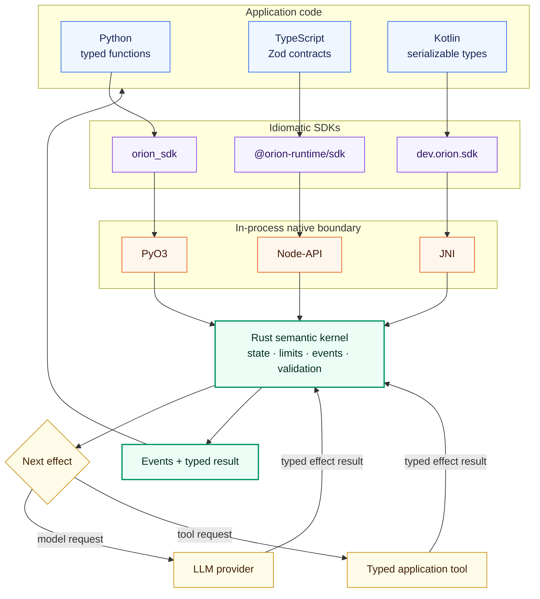
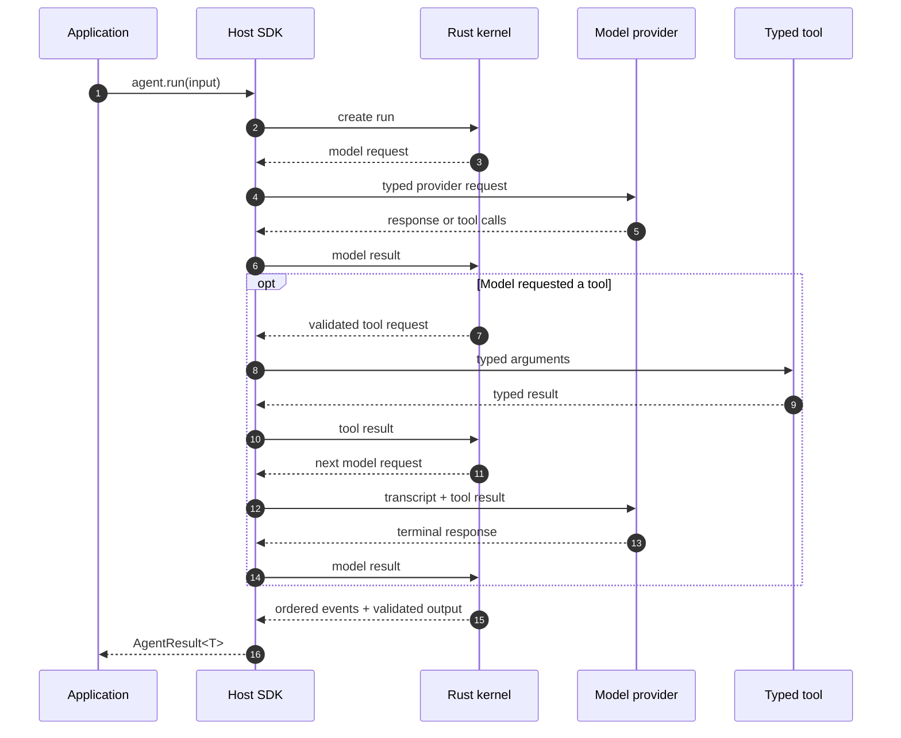

<div align="center">

# Orion

### One Rust core. Three idiomatic SDKs. Reliable agent execution.

Build typed LLM agents in Python, TypeScript, or Kotlin while a deterministic
Rust state machine owns the execution semantics.

[](https://github.com/GtechGovind/orion/actions/workflows/ci.yml)
[](https://github.com/GtechGovind/orion/releases/latest)
[](https://pypi.org/project/orion-agent-sdk/)
[](https://www.npmjs.com/package/@orion-runtime/sdk)
[](https://central.sonatype.com/artifact/io.github.gtechgovind/orion-kotlin-sdk)
[](rust-toolchain.toml)
[](sdks/python/README.md)
[](sdks/javascript/README.md)
[](sdks/kotlin/README.md)
[](#license)

[Quick start](#quick-start) · [Examples](examples/README.md) ·
[Documentation](docs/README.md) · [Architecture](docs/architecture/overview.md) ·
[Roadmap](docs/planning/roadmap.md)

</div>

---

Orion is an open-source, cross-language runtime for agents that call models,
execute typed tools, stream lifecycle events, and return structured results.
Application code stays natural in its host language; the critical state machine
runs in-process through PyO3, Node-API, or JNI—never through a JSON subprocess.

> **Release status:** `0.0.1` is the first usable pilot. The single-agent model
> and tool loop is implemented and tested across all three SDKs. Durability,
> approvals, retries, and policy enforcement remain roadmap work.

## Live release

| SDK | Public coordinate | Install `0.0.1` | Status |
|---|---|---|---|
| Python | [`orion-agent-sdk`](https://pypi.org/project/orion-agent-sdk/0.0.1/) | `python -m pip install orion-agent-sdk==0.0.1` | Published |
| TypeScript/JavaScript | [`@orion-runtime/sdk`](https://www.npmjs.com/package/@orion-runtime/sdk/v/0.0.1) | `npm install @orion-runtime/sdk@0.0.1` | Published |
| Kotlin/JVM | [`io.github.gtechgovind:orion-kotlin-sdk`](https://central.sonatype.com/artifact/io.github.gtechgovind/orion-kotlin-sdk/0.0.1) | `implementation("io.github.gtechgovind:orion-kotlin-sdk:0.0.1")` | Published; Central mirrors may take time to synchronize |

The [GitHub release](https://github.com/GtechGovind/orion/releases/tag/v0.0.1)
contains every supported native package and a portable `SHA256SUMS` manifest.
Current binaries target macOS arm64, Linux x86-64 glibc, and Windows x86-64.

## Why Orion?

| Deterministic core | Native developer experience | Typed end to end |
|---|---|---|
| Rust owns transitions, limits, event order, cancellation, and validation. | Python functions, TypeScript Zod schemas, and Kotlin serializers remain idiomatic. | Tool arguments and structured output are validated at the Rust boundary and decoded into host types. |

Additional design guarantees:

- **One supported workflow** — provider model → typed tool → `Agent` →
  `run`/`stream` → `AgentResult<T>`.
- **No duplicate low-level API** — runners, registries, codecs, protocol DTOs,
  model references, and native sessions remain internal.
- **Stable failures** — equivalent error categories, retryability, and retry
  delays across Python, TypeScript, and Kotlin.
- **Same behavior everywhere** — every SDK passes the same deterministic
  model → tool → model scenario through Rust.

## Quick start

Install the Python SDK, set an OpenAI-compatible API key, and run a typed agent:

```bash
python -m pip install orion-agent-sdk==0.0.1
export OPENAI_API_KEY="your-key"
```

```python
import asyncio
from dataclasses import dataclass

from orion_sdk import Agent, OpenAI


@dataclass(frozen=True, slots=True)
class Weather:
    city: str
    temperature_c: int


async def get_weather(city: str) -> Weather:
    """Get the current weather for a city."""
    return Weather(city=city, temperature_c=31)


async def main() -> None:
    agent = Agent(
        model=OpenAI("gpt-5-mini"),
        tools=[get_weather],
        output=Weather,
        instructions="Use the weather tool.",
    )

    result = await agent.run("What is the weather in Delhi?")
    print(result.output)


asyncio.run(main())
```

Prefer another language? Start with the
[TypeScript SDK](sdks/javascript/README.md) or
[Kotlin SDK](sdks/kotlin/README.md). Complete multi-file weather applications
for all three languages live in [`examples/`](examples/README.md).

## How it works



The SDK performs provider and tool I/O, then resumes the Rust-owned run with a
typed effect result. Mutable kernel state stays in Rust; only versioned DTOs
cross the native boundary. Read the
[runtime boundary](docs/architecture/runtime-boundary.md) for the detailed
ownership model.

### One agent turn



## Implemented in `0.0.1`

| Capability | Status |
|---|---|
| Rust-owned model/tool state machine | ✅ Implemented |
| Python, TypeScript, and Kotlin SDKs | ✅ Implemented |
| Typed tools and structured terminal output | ✅ Implemented |
| Streaming lifecycle events and normalized usage | ✅ Implemented |
| Cancellation, turn limits, and stable error categories | ✅ Implemented |
| OpenAI-compatible model endpoints | ✅ Implemented |
| Checkpoint persistence and replay | 🧭 Planned |
| Retry scheduling, approvals, and policy evaluation | 🧭 Planned |
| Public PyPI, npm, and Maven Central coordinates | ✅ Automated for `0.0.1` |

See the [public API contract](docs/contracts/public-api.md),
[LLM connectivity guide](docs/guides/llm-connectivity.md), and
[roadmap](docs/planning/roadmap.md) for the precise supported boundary.

## Build and verify

```bash
cargo fmt --all --check
cargo clippy --workspace --all-targets --all-features -- -D warnings
cargo test --workspace --all-features
```

Language-specific build, package, and clean-consumer commands are documented in
the [pilot guide](docs/guides/pilot.md) and
[installation guide](docs/guides/installation.md).

## Repository map

```text
crates/          Rust protocol, kernel, policy, persistence, FFI, and test crates
bindings/        PyO3, Node-API, and JNI integration boundaries
sdks/            Idiomatic Python, JavaScript/TypeScript, and Kotlin SDKs
examples/        Runnable, type-checked cross-language applications
conformance/     Cross-language behavioral scenarios and expected traces
schemas/         Versioned wire and persistence schemas
docs/            Architecture, contracts, ADRs, guides, policy, and roadmap
.github/         CI, release, issue, and contribution automation
```

The complete ownership and use case of each maintained path is in the
[repository layout guide](docs/development/repository-layout.md).

## Contributing

Orion welcomes implementation, conformance, benchmark, documentation, security,
and design-partner contributions. The
[competitive roadmap](docs/planning/roadmap.md) lists contributor-ready
milestones and fundable work packages. Public contracts should follow an
accepted issue or ADR so equivalent behavior can be implemented in Rust and
every SDK together. Start with the [contribution guide](.github/CONTRIBUTING.md),
then read the [engineering instructions](AGENTS.md) and
[governance policy](docs/policy/governance.md).

## Maintainer

Orion is maintained by Govind Yadav
([@GtechGovind](https://github.com/GtechGovind),
<gtech.govind2000@gmail.com>).

## License

Licensed under either the [Apache License 2.0](LICENSE-APACHE) or the
[MIT License](LICENSE-MIT), at your option.
