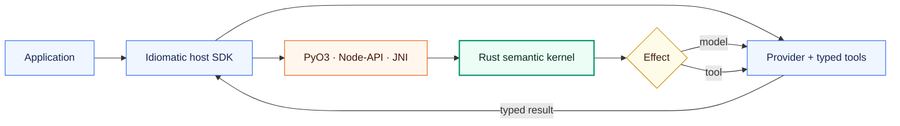
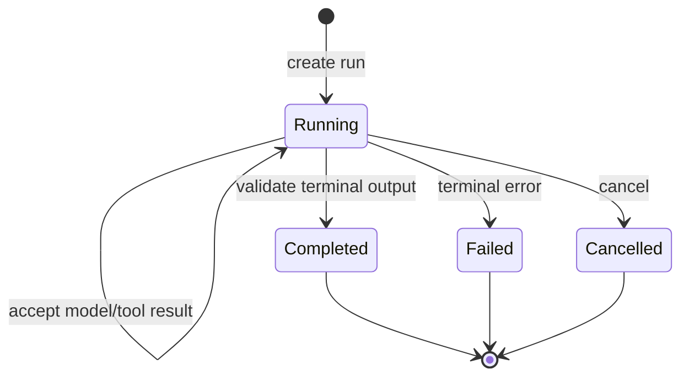

# Architecture overview

## Objective

Orion provides one reliable execution model across multiple host
languages without making those languages share one unnatural public API.

## Layers

The Rust kernel is a deterministic state machine. It consumes commands and
effect results, updates run state, emits ordered events, and returns either the
next effect or a terminal outcome.

The binding owns an opaque Rust session and converts language DTOs directly to
protocol values. The host SDK owns asynchronous I/O. This prevents Rust from
directly invoking arbitrary Python callbacks, JavaScript functions, or Kotlin
lambdas across foreign runtime boundaries.

## Runtime states

The `0.0.1` implementation exposes running, completed, failed, and cancelled
states. Preparing, checkpointing, suspension, handoff, and durable replay are
design targets for later roadmap milestones.

## Invariants

- Exactly one terminal outcome per run.
- Every state-changing transition has an ordered event sequence number.
- A resumed run does not blindly repeat a durable completed external action.
- Agent definitions do not contain mutable run state.
- Provider-native values do not enter kernel state.
- Suspension is a successful lifecycle state rather than a failure.
- Cancellation is distinct from failure.
