# Orion roadmap

Orion aims to become the reliable, language-neutral execution layer for typed
LLM agents. The project will compete on runtime correctness, portable behavior,
and production operations—not on the number of thin provider wrappers.

This roadmap guides collaboration and funding. It records intended outcomes,
not delivery dates or contractual commitments. A capability is not complete
until its Rust semantics, native bindings, Python/TypeScript/Kotlin APIs,
conformance tests, examples, and documentation ship together.

## Product direction

Orion's differentiators are:

- **One semantic core:** Rust owns state transitions, limits, cancellation,
  validation, replay decisions, and stable error categories.
- **Idiomatic host APIs:** applications use typed functions and data models in
  their own language instead of protocol maps or subprocess calls.
- **Behavioral parity:** the same conformance scenarios produce equivalent
  event traces in Python, TypeScript, and Kotlin.
- **Operational reliability:** durability, idempotency, approvals, budgets,
  observability, and recovery are first-class runtime behavior.
- **Narrow public contracts:** each capability has one documented workflow,
  keeping applications understandable as the platform grows.

## Current baseline — `0.0.1`

| Area | Available now | Next gap |
|---|---|---|
| Execution | Deterministic model → tool → model state machine | Durable suspension and replay |
| SDKs | Python, TypeScript, and Kotlin with native bindings | Broader conformance coverage |
| Types | Typed tools, structured output, events, usage, and errors | Versioned compatibility guarantees |
| Providers | OpenAI-compatible endpoints | Provider contract and fault suites |
| Delivery | Multi-platform package and release automation | Expanded platform matrix and supply-chain hardening |

## Competitive milestones

```mermaid
flowchart LR
    V001["0.0.1<br/>Typed native pilot"]
    V002["0.0.2<br/>Conformance + reliability"]
    V003["0.0.3<br/>Durable execution"]
    V004["0.0.4<br/>Production controls"]
    V005["0.0.5<br/>Ecosystem + scale"]
    V010["0.1.0<br/>Stability candidate"]

    V001 --> V002 --> V003 --> V004 --> V005 --> V010

    classDef shipped fill:#ecfdf5,stroke:#059669,color:#022c22,stroke-width:2px
    classDef reliability fill:#eff6ff,stroke:#2563eb,color:#172554
    classDef durability fill:#f5f3ff,stroke:#7c3aed,color:#2e1065
    classDef operations fill:#fff7ed,stroke:#ea580c,color:#431407
    classDef scale fill:#fdf2f8,stroke:#db2777,color:#500724
    classDef stable fill:#fefce8,stroke:#ca8a04,color:#422006,stroke-width:2px
    class V001 shipped
    class V002 reliability
    class V003 durability
    class V004 operations
    class V005 scale
    class V010 stable
```

### `0.0.2` — Conformance and reliability

Outcome: contributors can change the runtime with fast evidence that every SDK
still behaves the same.

- Golden traces for success, tool failure, provider failure, cancellation,
  malformed output, and turn exhaustion
- Property and fuzz tests for protocol decoding and state transitions
- Cross-language package-consumer tests on every supported operating system
- Benchmark baselines for transition latency, binding overhead, and memory use
- Release provenance, artifact inventory, and installation smoke tests

Good contributions: conformance fixtures, failure-path tests, fuzz targets,
benchmark harnesses, CI reliability, and documentation examples.

### `0.0.3` — Durable execution

Outcome: an interrupted run can restart without duplicating completed work.

- Versioned checkpoint format and migration rules
- Storage port plus an in-memory reference implementation
- Action ledger, idempotency keys, and replay-safe effect completion
- Suspend, resume, and recovery state transitions
- Equivalent durable-run APIs and examples in every SDK

Good contributions: storage design reviews, migration fixtures, fault-injection
tests, embedded-store adapters, and crash/restart integration environments.

### `0.0.4` — Production controls

Outcome: operators can bound, inspect, and intervene in live agent runs.

- Retry classification, backoff, budgets, deadlines, and rate-limit handling
- Human approval and policy-decision effects
- Structured tracing, metrics, and OpenTelemetry integration
- Redaction rules and security-focused event export
- Operator runbook and failure-recovery examples

Good contributions: SRE design partnerships, telemetry conventions, policy
engines, chaos tests, security reviews, and real workload traces.

### `0.0.5` — Ecosystem and scale

Outcome: Orion supports realistic applications without weakening its portable
runtime contract.

- Provider compatibility suites and additional model integrations
- Streaming tool results and bounded concurrent effects
- Composable agent handoffs with explicit ownership and budgets
- Store and provider certification fixtures for third-party integrations
- Larger multi-agent and long-running examples in every SDK

Good contributions: provider maintainers, framework integrations, scale tests,
reference applications, and independent compatibility implementations.

### `0.1.0` — Stability candidate

Outcome: early adopters can build against an intentional compatibility policy.

- Public-contract audit and compatibility mode enabled
- Supported platform and toolchain policy
- Threat model, independent security review, and dependency audit
- Performance targets with published benchmark results
- Upgrade, deprecation, and long-term maintenance policies

`0.1.0` is a stability candidate, not a claim that every production feature is
complete. Compatibility begins only through an explicit ADR and release note.

## Participation paths

### Contributors

1. Choose a milestone and open a focused
   [GitHub issue](https://github.com/GtechGovind/orion/issues).
2. Describe the user outcome, affected invariant, and cross-language surface.
3. Use an ADR for protocol, lifecycle, persistence, or public API decisions.
4. Deliver the Rust-to-SDK vertical slice with tests and documentation.

Useful non-code contributions include design review, reproducible bug reports,
conformance scenarios, benchmarks, documentation, security analysis, and
real-world adoption feedback.

### Design partners

Teams evaluating Orion can contribute anonymized requirements and failure
scenarios. High-value inputs include restart behavior, audit requirements,
latency budgets, provider constraints, deployment platforms, and SDK ergonomics.
Open an issue titled `Design partner: <use case>` without including secrets or
private customer data.

### Funders and sponsors

Funding is most useful when attached to an auditable work package. Current
priorities are:

| Work package | Fundable outcome |
|---|---|
| Durable execution | Checkpoint specification, reference store, recovery tests, and all-SDK example |
| Reliability lab | Fault injection, fuzzing, benchmarks, and public regression dashboard |
| Supply-chain release | Expanded native targets, signing, provenance, SBOMs, and clean-consumer verification |
| Observability | Stable telemetry contract, OpenTelemetry integration, dashboards, and operator guide |
| Security | Threat model, binding audit, dependency review, and external assessment |

Funders may sponsor an outcome but do not bypass architecture review, security
requirements, cross-language parity, or maintainer review. To discuss a funded
work package, open a public issue labeled as a proposal or contact the
[maintainer](../../README.md#maintainer). Public scope, acceptance criteria, and
progress reporting are preferred whenever confidentiality permits.

## Prioritization and completion

Work is prioritized by user impact, runtime risk reduction, cross-language
value, maintainer capacity, and availability of reproducible tests. Funding can
increase capacity but does not automatically change technical priority.

A roadmap item is complete only when:

- the protocol and invariants are documented;
- the Rust implementation and native bindings are tested;
- Python, TypeScript, and Kotlin expose the same capability idiomatically;
- conformance and failure-path tests pass on supported platforms;
- examples, installation guidance, and release notes are updated; and
- security, resource bounds, and compatibility impact are reviewed.

See the [contribution guide](../../.github/CONTRIBUTING.md),
[governance policy](../policy/governance.md), and
[public API contract](../contracts/public-api.md) before proposing a milestone
change.
